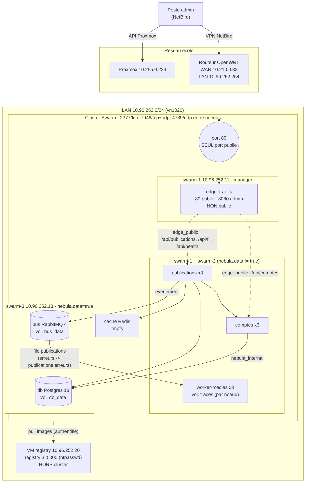

# Schema reseau Nebula

Version image : [schema-reseau.png](schema-reseau.png).

Pointilles : reseau `edge_public`. Traits pleins : reseau `nebula_internal` (`internal: true`, sans sortie Internet).

| Reseau | Membres | Joignable depuis |
|---|---|---|
| `edge_public` (overlay) | traefik, comptes, publications | Traefik uniquement |
| `nebula_internal` (overlay, `internal: true`) | comptes, publications, worker, db, bus, cache | services internes ; aucune sortie Internet |
| Port publie | 80 (Traefik, routing mesh) | tout le LAN, sur les 3 noeuds |
| Admin Traefik | :8080 dans le conteneur, non publie | tunnel SSH vers swarm-1 + mot de passe |
